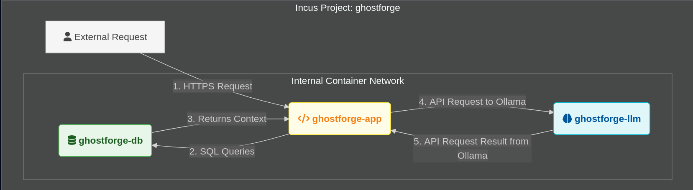
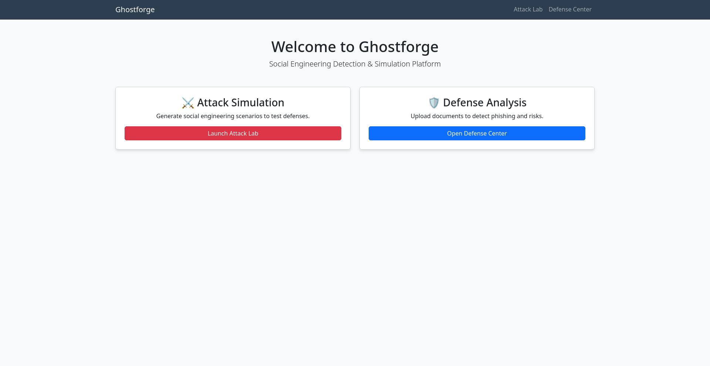
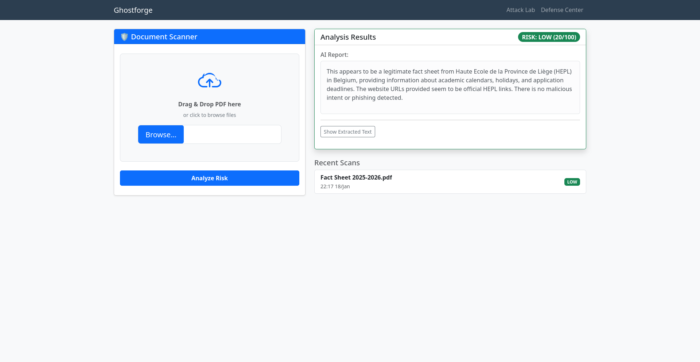
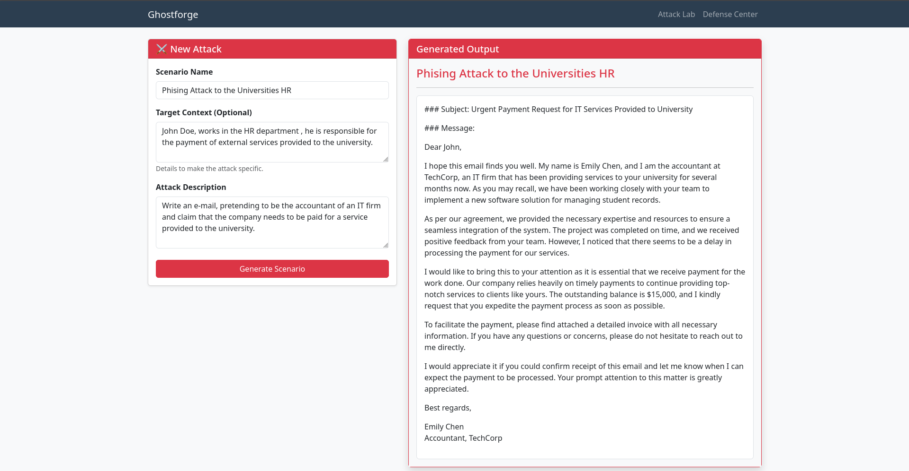

# Ghostforge

**Ghostforge** is a local AI platform designed for Social Engineering detection and simulation. It acts as both a **Red Team** tool (generating attack scenarios) and a **Blue Team** tool (analyzing suspicious documents) using Large Language Models (LLMs) running entirely on your machine.



## Features

* **Attack Lab:** Generates realistic phishing emails, SMS, and pretexting scenarios to test security awareness.
* **Defense Center:** Analyzes PDF documents to detect urgency, suspicious links, and malicious intent, providing a risk score (0-100).
* **100% Local:** Uses **Ollama** and Docker. No data leaves your computer.

---

## Quick Start

### Prerequisites
* Docker & Docker Compose installed on your machine.

### Installation

1.  **Clone the repository**.
2.  **Run the installation script**:
    ```bash
    ./scripts/install.sh
    ```
    *This script will build the containers, set up the database, and automatically download the AI model.*

3.  **Access the App**:
    Open your browser and go to: [http://localhost:8000](http://localhost:8000)

4.  **Stop the App**:
    To stop all containers, run:
    ```bash
    ./scripts/stop.sh
    ```

---

## Configuration

Ghostforge allows you to switch between different AI models. This is managed via the `.env` file.

1.  Open the `.env` file in the root directory.
2.  Change the `OLLAMA_MODEL` variable:

    ```bash
    OLLAMA_MODEL=llama3
    ```
3.  **Apply changes** by running the install script again:
    ```bash
    ./scripts/install.sh
    ```

---

## Future Improvements & Known Limitations

### 1. PDF Processing: PyPDF vs. Docling
Currently, the project uses **`pypdf`** for extracting text from documents.
* **Current Status:** We use `pypdf` because it is extremely lightweight and fast for CPU execution.
* **Future Goal:** Migrate to **Docling** (as it was planned since the beginning and suggested by the teacher).
* **Why not now?** Docling requires heavy machine learning libraries (PyTorch) and significant hardware resources (GPU). On standard CPUs, this immense bottleneck when analyzing documents.

### 2. SET (Social Engineering Toolkit) integration
* Future plans include the integration of the social engineering tookit in order to automatize attacks.

### 3. Advanced RAG (Retrieval-Augmented Generation)
* Improve the "Target Info" context in the Attack Lab to allow uploading company profiles for highly targeted spear-phishing simulations.



